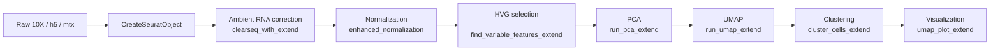

# ClearSeqExtend

> **An enhanced toolkit for ambient RNA correction and end‑to‑end scRNA‑seq analysis in R**

<p align="center">
  
</p>

<p align="center">
  <a href="https://github.com/madhubioinformatics/ClearSeqExtend/actions"></a>
  <a href="https://github.com/madhubioinformatics/ClearSeqExtend"></a>
  <a href="LICENSE"></a>
  <a href="https://www.r-project.org/">= 4.2"/></a>
  <a href="https://www.bioconductor.org/"></a>
</p>

---

## ✨ Highlights

* **Robust ambient RNA correction** with simple, transparent parameters.
* **Seamless Seurat integration** (via *SeuratExtend*) for normalization, HVG selection, PCA/UMAP, clustering, and plots.
* **Publication‑ready figures** with sensible defaults and export helpers.
* **Reproducible workflows**: minimal boilerplate, sensible file structure, and clear provenance.

---

## 📦 Installation

> **Prerequisites:** R ≥ 4.2, `Seurat (v4/v5)` recommended, and a C++ toolchain for typical R package compilation.

```r
# Install devtools (if needed)
install.packages("devtools")

# Install ClearSeqExtend from GitHub
devtools::install_github("madhubioinformatics/ClearSeqExtend")

# Install SeuratExtend (dependency)
if (!requireNamespace("remotes", quietly = TRUE)) install.packages("remotes")
remotes::install_github("huayc09/SeuratExtend")
```

> **Tip:** If you use renv, run `renv::init()` and then `renv::snapshot()` after installing to lock dependencies.

---

## 🚀 Quick Start

```r
library(Seurat)
library(SeuratExtend)
library(ClearSeqExtend)

# 1) Load data & create Seurat object
pbmc_data  <- Read10X_h5("path_to_data/10k_PBMC_3p_nextgem_Chromium_X_raw_feature_bc_matrix.h5")
seurat_obj <- CreateSeuratObject(counts = pbmc_data, project = "PBMC")

# 2) Ambient RNA correction
seurat_obj <- clearseq_with_extend(seurat_obj, threshold = 10)

# 3) Normalize + select variable features
seurat_obj <- enhanced_normalization(seurat_obj)
seurat_obj <- find_variable_features_extend(seurat_obj)

# 4) Dimensionality reduction
seurat_obj <- run_pca_extend(seurat_obj)
seurat_obj <- run_umap_extend(seurat_obj, dims = 1:10)

# 5) Clustering + plotting
seurat_obj <- cluster_cells_extend(seurat_obj, resolution = 0.5)
umap_plot  <- umap_plot_extend(seurat_obj)
print(umap_plot)
```

<p align="center">
  
</p>

---

## 🧭 Visual Workflow



---

## 🔧 Key Functions

| Stage              | Function                                | What it does                                                            |
| ------------------ | --------------------------------------- | ----------------------------------------------------------------------- |
| Ambient correction | `clearseq_with_extend()`                | Removes ambient RNA contamination with a simple threshold & QC hooks    |
| Normalization      | `enhanced_normalization()`              | Log‑normalization with stable defaults compatible with Seurat workflows |
| HVG                | `find_variable_features_extend()`       | Robust HVG selection to drive embeddings                                |
| DR                 | `run_pca_extend()`, `run_umap_extend()` | Consistent PCA/UMAP wrappers with sensible parameters                   |
| Clustering         | `cluster_cells_extend()`                | Leiden/Louvain clustering with common resolution settings               |
| Viz                | `umap_plot_extend()`                    | Publication‑ready UMAPs out‑of‑the‑box                                  |

> See `?clearseq_with_extend` etc. for full argument lists and examples.

---

## 📁 Recommended Project Structure

```
project/
├─ data/                        # input data (h5/mtx/loom)
├─ scripts/                     # analysis scripts
├─ results/
│  ├─ figures/
│  └─ tables/
└─ renv/                        # optional reproducible env
```

---

## 🧪 Minimal Reproducible Example (PBMC)

```r
# Download PBMC 10k (if needed) and set `path_to_data` accordingly
library(ClearSeqExtend)
library(SeuratExtend)
library(Seurat)

pbmc_data  <- Read10X_h5("path_to_data/pbmc_10k_raw_feature_bc_matrix.h5")
seurat_obj <- CreateSeuratObject(pbmc_data, project = "PBMC10k")

seurat_obj <- clearseq_with_extend(seurat_obj, threshold = 10)
seurat_obj <- enhanced_normalization(seurat_obj)
seurat_obj <- find_variable_features_extend(seurat_obj)
seurat_obj <- run_pca_extend(seurat_obj)
seurat_obj <- run_umap_extend(seurat_obj, dims = 1:15)
seurat_obj <- cluster_cells_extend(seurat_obj, resolution = 0.6)

p <- umap_plot_extend(seurat_obj)
print(p)

# Save figure
ggplot2::ggsave("results/figures/umap_pbmc10k.png", p, width = 6, height = 5, dpi = 300)
```

---

## 📊 Tips for Publication‑Ready Figures

* Export with `dpi = 300–600`, `width/height` in inches, and vector PDF for manuscripts.
* Use consistent palettes (e.g., `scale_color_brewer(palette = "Set2")`).
* Annotate clusters with domain‑relevant labels before exporting.

---

## ❓ FAQ

**Q: How do I choose the `threshold` for ambient correction?**
A: Start with `threshold = 10` for 10x UMI data; inspect knee plots / empty‑drop profiles and adjust if necessary.

**Q: Is Seurat v5 supported?**
A: Yes. The wrappers are designed to work with Seurat v4/v5 conventions.

**Q: Can I run this on HPC?**
A: Yes. Wrap these calls inside your SLURM script and pin a consistent R/Seurat environment.

---

## 🧩 Compatibility

* **Input:** 10x Genomics (h5/mtx), generic count matrices.
* **R:** ≥ 4.2; tested on Linux/macOS.
* **Integrations:** Seurat (v4/v5), SeuratExtend.

---

## 🤝 Contributing

Pull requests are welcome! Please open an issue describing the change and include a minimal example. Consider adding a unit test when feasible.

---

## 📜 Citation

If you use **ClearSeqExtend** in your work, please cite:

> *Saddala MS.*, **ClearSeqExtend: An Enhanced Toolkit for Ambient RNA Correction and scRNA‑seq Analysis** (2025). GitHub.

```
@misc{ClearSeqExtend2025,
  author       = {Saddala, Madhu Sudhana},
  title        = {ClearSeqExtend: An Enhanced Toolkit for Ambient RNA Correction and scRNA-seq Analysis},
  year         = {2025},
  howpublished = {GitHub},
  url          = {https://github.com/madhubioinformatics/ClearSeqExtend}
}
```

---

## 📄 License

MIT License. See [LICENSE](LICENSE) for details.

---

### Acknowledgments

* Built on the shoulders of **Seurat** and **SeuratExtend**.
* Thanks to collaborators and testers for continuous feedback.
